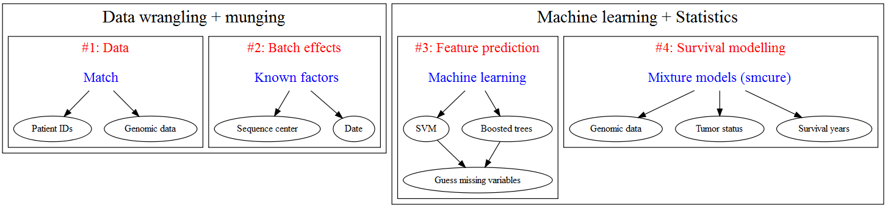

```{r,echo=F,message=FALSE,warning=FALSE,results='hide'}
# Call in the CRAN packages
ll <- c('tidyverse','magrittr','cowplot','scales','ggrepel','GGally')
        # 'survival','smcure','survminer')
sapply(ll,function(l) require(l,character.only = T))
# Load the data
load('C:/Users/erikinwest/Documents/ML/Bio/Cancer/tcga/rmd_data.RData')
attach(rmd.list)
# Assign the names...
for (k in 1:length(rmd.list)) {
  assign(names(rmd.list)[k],rmd.list[[names(rmd.list)[k]]])
}
```

## Background

The advent of [next-generation sequencing](https://en.wikipedia.org/wiki/DNA_sequencing#High-throughput_sequencing_.28HTP.29_methods) technology has given biologists a detailed resource with which they can better understand how cellular states are expressed in RNA sequence counts[[^1]]. Statisticians have also been taking advantage of the NGS revolution by using [machine learning algorithms](https://www.ncbi.nlm.nih.gov/pmc/articles/PMC4348437/) to handle these over-determined datasets[[^2]] and classify patient cell samples into low/high risk cancer genotypes. At the same time, genomic data has also been incorporated into [survival analysis](https://www.ncbi.nlm.nih.gov/pmc/articles/PMC4246473/) research, with the obvious modelling benefit that baseline tumor expression contains information related to how likely a patient will respond to certain drugs or how aggressive the cancer is likely to be. While [RNA-seq](https://en.wikipedia.org/wiki/RNA-Seq) is probably the best known high throughtput sequencing technology, regulatory (e.g. [micro-RNA](https://erikdrysdale.github.io/mirna_classification)) and epigenetic (e.g. [methylation](https://en.wikipedia.org/wiki/DNA_methylation)) factors are also extremely important in understanding how biological systems actually work, and can be used in a clinical setting such as understanding [chemoresistance](http://www.nature.com/articles/srep24706). 

Developments in data generation are being matched by more advanced statistical inference techniques and algorithms. In time-to-event models, i.e. [survival analysis](https://en.wikipedia.org/wiki/Survival_analysis), the testing of underlying model assumptions has been done through a range of residual-based tests such as [Cox-Snell, Martingale, Deviance, and Schoenfeld](http://www.math.ucsd.edu/~rxu/math284/slect9.pdf). The advantages of each of these approaches has been studied in detail for classical Cox regression models. However the classical survival models assume that the probability of the event approaches one  asymptotically; an assumption which fails to represent situations in which a disease state can be reversed. In [mixture cure models](http://post.queensu.ca/~pengp/papers/Peng2014_4.pdf), the survival function can be written as a weighted sum of cured, and uncured ($u$) patients, as the equation below shows (this can be compared to the classical case which was discussed in a [previous post](https://erikdrysdale.github.io/survival/)). Inference is then done by determining the covariates which affect the probability of being cured ($\pi$) and the duration of survival time. In this sense, the model can be decomposed into an "incidence model" (probability of a cure) and "latency model" (event time).

$$\begin{aligned} P(T>t) = S(t) = \pi S_u + (1-\pi) \hspace{2cm} \text{Mixture cure model} \end{aligned}$$

Implementing mixture models in `R` can be done through the `smcure` package. Additionally, residual-based tests for these models have been developed [very recently](https://www.ncbi.nlm.nih.gov/pubmed/27598783) in a *Biometrics* paper (by my supervisor incidentally).

## The Cancer Genome Atlas

Combining these multiple NGS sequencing technologies with clinical records in cancer research is now possible thanks to [The Cancer Genome Atlas](https://en.wikipedia.org/wiki/The_Cancer_Genome_Atlas) (TCGA) project, which provides "gene expression profiling, copy number variation profiling, SNP genotyping, genome wide DNA methylation profiling, microRNA profiling, and exon sequencing of at least 1,200 genes" for more than 30 cancer types. Datasets are completely free to access for researchers[[^3]], and can downloaded in bulk from [firebrowse](http://firebrowse.org/). `R` users also benefit from the curated `RTCGA` package which contains the major clinical and sequencing datasets in an R-friendly format. 

I started by writing a program that assembled the RNA-seq and clinical datasets for 27 cancer cohorts form the `RTCGA.clinical` and `RTCGA.rnaseq` libraries, and proceeded to clean up the data:

1. Selecting only the cancer cells (data contains healthy controls as well)
2. Dropping duplicate patient IDs
3. Dropping observations with nonsensical clinical values (such as being alive but having a recorded time to death)

This left me with almost 9K unique patient IDs and more than 20K genes. In machine learning, feature selection is a critical step anytime **p >> N**, and the statistician's goal is to find a smaller set of covariates that contain the maximal amount of information from the dataset. As I talked about [previously](https://erikdrysdale.github.io/mirna_classification/), there are essentially three techniques of feature selection: (1) filter methods, (2) wrapper methods, and (3) embedded methods. The first uses characteristics of the data to pare down features, the second uses in-sample modelling performance to select features, and the third uses built-in model techniques (such as [LASSO](https://en.wikipedia.org/wiki/Lasso_(statistics))).

As this post is meant as a motivating discussion, I will use some classical filtering methods to see the likely distribution of signal-to-noise in the dataset, by considering three dimensions of biological signals:

* Gene-wise correlation with survival outcomes (A)
* Gene-wise t-tests between alive and deceased status (B)
* Expression differences between survival versus disease free status (C)

Figure A below shows the distribution gene-wise (RNA-seq) correlation coefficients and survival times for patients that are both alive and deceased in the TCGA dataset. We see that the highest (absolute) correlation coefficients are at 0.25, with the number of highly correlated genes falling off rapidly until the 75th percentile. Figure B shows a classical volcano plot, with around 30% of genes being differentially expressed (as measured by a t-test and a Bonferroni cutoff) between patients that are alive and dead. Repeating the same gene-wise t-tests for patients who are with and without tumors currently, and plotting these against the previous t-tests we find around 120 genes which show the opposite expression relationship (Figure C). This preliminary filtering analysis suggests that a machine learning model should begin with about 33% (5-6K) of the gene expression profiles as a baseline. However, as Figure C shows, if features are thrown out too quickly (e.g. using only one filtering metric) then important biological signals may be discarded. For final model prediction, a much smaller set of covariates will be used, with wrapper and embedded methods further paring down the feature space.

```{r explatory1,echo=F,fig.width=10,fig.height=5.0}
# Plot our three plots
gg.temp <- plot_grid(ggplot() + draw_label('Figure: RNA-seq and clinical data'),
          plot_grid(gg.cox,gg.volc1,gg.corr,ncol=3,labels=LETTERS[1:3]),nrow=2,rel_heights = c(1,6))
plot(gg.temp)
```

## Next steps

I see the following road map for building a survival analysis model for the TCGA:




* * *

[^1]: While I am not an expert on this technology, my understanding is that NGS allows can measure read count, whereas classical DNA microarrays measure relative expression of oligonucleotide sequences against some reference genome.

[^2]: Meaning that features vastly outnumber observations in these datasets. For example, just using the RNAseq measurements for the exome (protein-producing genes) generates 25,000 features for one patient. 

[^3]: Except the raw sequencing data, which requires permission to access due to privacy concerns.

