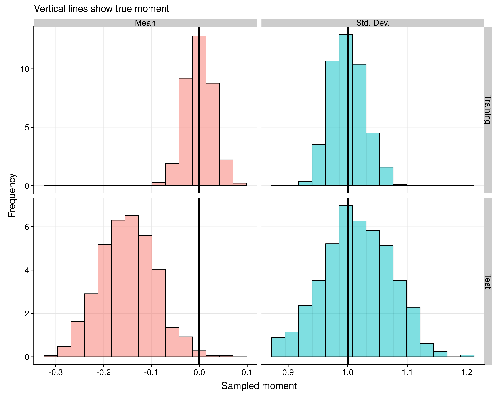
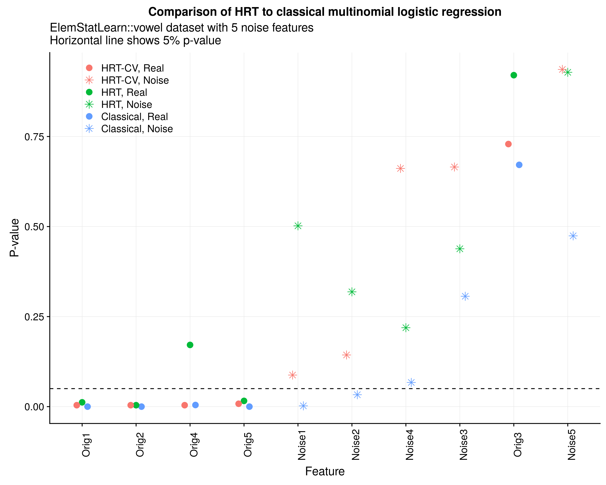
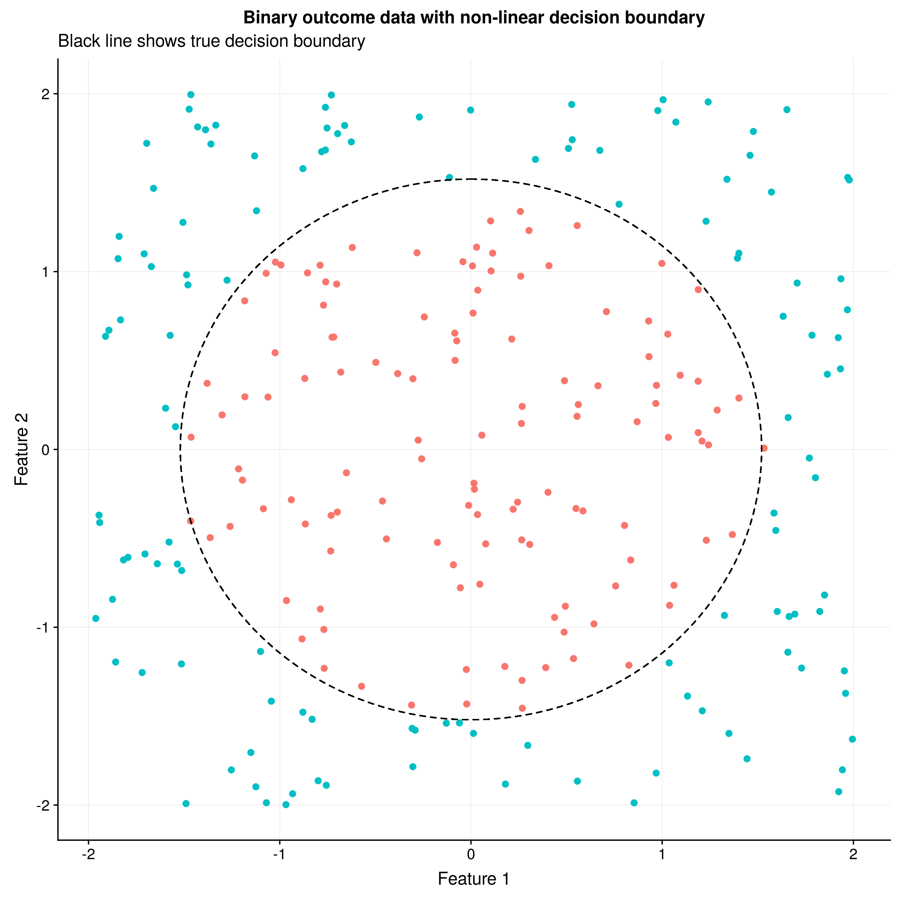

$$
\newcommand{\bX}{\boldsymbol{X}}
\newcommand{\bx}{\boldsymbol{x}}
\newcommand{\by}{\boldsymbol{y}}
\newcommand{\bp}{\boldsymbol{p}}
\newcommand{\bXt}{\tilde{\bX}}
\newcommand{\btheta}{\boldsymbol{\theta}}
\newcommand{\bThet}{\boldsymbol{\Theta}}
\newcommand{\bSigma}{\boldsymbol{\Sigma}}
$$

### Background

It is an exciting time for statistical inference in the high-dimensional and machine learning settings. Techniques like [Selective Inference](https://www.pnas.org/content/112/25/7629.full) (SI) have shown that certains classes of models (such as the Lasso or forward stepwise regression) can have valid inference procedures performed *after* model selection. This discovery was groundbreaking as it showed how the degree of model overfitting could be explicitely quantified and conditioned on. While SI only works for a subset of linear model fitting procedures, the [knockoffs](http://web.stanford.edu/group/candes/knockoffs/) method was another innovative technique that could be applied to any statistical learning model and perform variable selection with guaranteed false discovery rate properties. The original knockoffs approach required two things: (1) a model that could generate variable importance statistics that satisfied two fairly simple properties,[[^1]] and (2) a low-dimensional design matrix ($n > 2p$). The "knockoff" refers to a copy of a original design matrix constructed in such a way that it preserved the conditional dependence between variables, but made the knockoff copies as orthogonal as possible. In other words, knockoff features "x1" and "x2" have the same degree of correlation that is seen in real features "x1" and "x2", but the real feature "x1" was approximately orthogonal to knockoff feature "x1". A machine learning model was then fit to the data and the distribution of features importance metrics between the original and knockoffs features was compared. Because the distribution of these metrics should be the same when there is no conditional relationship to the response, a false discovery rate could be established using the properties of [martingales](https://en.wikipedia.org/wiki/Martingale_(probability_theory)). Extensions of the knockoffs approach to arbitrary $p$ [have been established](https://statweb.stanford.edu/~candes/papers/MF_knockoffs.pdf), but require estimating the conditional relationship of the variables in the columns of the design matrix with a statistical model (hereafter referred to as the permutation knockoff method).

Key to permutation knockoff method is that if distribution of the feature space is known we can draw "copies" of this design matrix $\bXt \sim P(\bX)$ and then see how a model evaluates the features of the concatenated feature space $\by \approx f_\btheta([\bX, \bXt])$ and examining the difference between $\theta_j$ and $\tilde{\theta}_j$, assuming that the parameter vector $\btheta$ encodes feature importance (otherwise some other metric must be used). By breaking the conditional distribution between the response and the features, but preserving the marginal distribution, the null of no effect can be tested with the advantage that a wide array of feature importance measures can be used for more complicated machine learning models like random forests and support vector machines (SVMs). While these feature importance metrics were able to give a rough approximation of how useful the feature was in the model, they had no clear statistical properties. In contrast, their knockoffs equivalents do have explicit statistical guarantees in terms of evaluating whether they have any statistical relationship to the response. 

However the knockoffs procedure suffers from two disadvantages. First, the amount of features that a model fits has to be doubled which reduces the effective power of the learning algorithm from the addition of noisy features. Second, for the permutation knockoff approach, the algorithm $f_\btheta(\cdot)$ needs to be repeatedly fitted. For large and complex models this can be computationally burdensome.

**It is worth pausing to note that the approach to inference carried out by knockoffs and the holdout randomization test (to be described below) inverts the usual method by which statistical inference has been carried out on a classical basis.** Instead of learning the conditional distribution of $P_\{\btheta\}(\by|\bX)$ parameterized by some vector $\btheta$, the distribution of $P(\bX)$ is first approximated and then a prediction task is carried out. While this requires more work because an unsupervised and supervised approach must be used, it also increases modelling flexibility and reduces the fragility of inference to parametric assumptions on the conditional distribution. For properly constructed approaches, errors in modelling either $P(\bX)$ or predicting $\by \approx f_\btheta([\bX, \bXt])$ translate into lower power and maintain an appropriate Type-I error rate level (in contrast to the classical approach where model misspecification can lead to errenous inference).

There is another method of model inference, what might be best called *local inference*, which aims to explain which features are used by the prediction model *at a given feature vector* $f_\btheta(\bx)$ which can be carried out with techniques like [LIME](https://github.com/marcotcr/lime) or [Shapley values](https://christophm.github.io/interpretable-ml-book/shapley.html). Whereas *local inference* procedures can have changing feature importance measures between different rows of the data, global inference procedures make statements about the relationship of features to the entire distribution of the data which is the focus of classical statistics. While *local inferrnece* methods are particularity useful for issues around [explainable AI](https://en.wikipedia.org/wiki/Explainable_artificial_intelligence) due to a variety of regulatory considerations, they are not the focus of this post.

### Holdout Randomization Test (HRT)

The [HRT](https://arxiv.org/abs/1811.00645) addresses the computational challenges of the permuation knockoff method by replacing the model fitting element with a prediction task. The computational complexity of querying a model that is already trained to make a prediction is usually trivial. Instead of looking at the relative variable importance measures of the original and sampled features, the HRT looks at the empirical risk scores between the original testing dataset and its repeatedly sampled version. Recall that in machine learning, the goal is to learn an algorithm $\by_R \approx f_\btheta(\bX_R)$ on some dataset $R$ that minimizes the risk function: $R(\btheta)=E[\ell(\by,f_\btheta(\bX_R))]$, where the risk is the expected loss (for some loss function $\ell(\cdot)$) for a given algorithm $f$. Because the learning algorithm is fit to some finite sample $\hat{f}_\btheta = \arg \min_\theta \sum_{i=1}^n \ell(y_i,f_\theta(\bx_i))$ (also known as empirical risk minimization), it will be an optimistic estimate of the risk due to overfitting. By reserving a held-out (or test) set of data $(\by_T, \bX_T)$, an unbiased estimate of the empirical risk can be established: $\hat{R}(\by_T,\bX_T,\hat{f})=\sum_{i=n+1}^{n+k} \ell(y_i,\hat{f}_\theta(\bx_i))$ (aka the empirical risk estimate). If we want to evaluate whether feature $j$, $\bX_{\cdot j}$ has any conditional relationship to the response, then we want to test whether there is a change in the empirical risk estimate evaluated under $\bXt^j = [\bX_{\cdot 1},\dots,\bXt_{\cdot j},\dots,\bX_{p}]$ where $\bXt_{\cdot j} \sim P(\bX_{\cdot j} | \bX_{\cdot, -j})$. In other words, we want to sample the $j^{th}$ column of the design matrix, conditional on all the other columns remaining the same. A valid p-value for feature $j$ can then be determined by simply counting the number of times the permuted test set has a lower risk score.

If $\bX_{\cdot j} \perp \!\!\! \perp  \by | \bX_{\cdot, -j}$, then drawing new copies of the $j^{th}$ feature should not impact the loss function. In the rest of this post, we will show how to construct a function wrapper that receives as inputs a design matrix, a response vector, a risk function, a model fitting procedure, and a traning/test split and returns p-values for each column. Under the hood, we will use multivariate Gaussian model to estimate $P(\bX)$ and then be able to draw $P(\bX_{\cdot j} | \bX_{\cdot, -j})$. Below I summarize the HRT algorithm (see Algorithm 1 from the [original paper](https://arxiv.org/abs/1811.00645)): $\texttt{HRT}(\bX,\by,R,T,f,\ell)$, where $\bX$ is the design matrix, $\by$ is the response, $R$ is training set index, $T$ is the test set index, $f$ is some algorithm which is optimized for $\btheta$, and $\ell(\by,\hat{\by})$ is a loss function for a true and predicted response label. 

**HRT Algorithm for feature $j$**
\begin{align*}
&\textbf{Step 1: Fit algorithm $f$} \\
\hat{\btheta} &= \arg \min_\theta \hspace{2mm} \ell(\by_R,f_\theta(\bX_R)), \hspace{3mm} \hat{f}_{\btheta} := f(\hat{\btheta}) \\
&\textbf{Step 2: Compute empirical risk for $\bX_T$} \\
\hat{R}(\hat{\btheta}) &= \ell(\by_T, \bX_T, \hat{f}(\btheta)) \\
&\textbf{Step 3: Sample feature $j$ $S$-times from test set and calculate permuted risk score  } \\
&\hspace{-6mm}\text{for $s$ in 1 to $S$}: \\
&\hspace{1cm}  \bXt_T^{(s)} \gets \bX_T \\
&\hspace{1cm} [\bXt_T^{(s)}]_{\cdot j} \gets P([\bX_T]_{\cdot j} | [\bX_T]_{\cdot, -j}) \\
&\hspace{1cm}  \hat{R}^{(s)}(\hat{\btheta}) = \ell(\by_T, \bXt_T^{(s)}, \hat{f}(\btheta)) \\
&\textbf{Step 4: Calculate one-sided p-value} \\
\hat{p}_j &= \frac{1}{1+S} \Bigg( 1 + \sum_{s=1}^S I \Big[ \hat{R}^{(s)}(\hat{\btheta})  \leq \hat{R}(\hat{\btheta}) \Big] \Bigg)
\end{align*}

The p-value generated from the permutation is necessarily one-sided because the risk is bounded from zero to positive infinity. By counting the number of times a randomly drawn feature $j$ obtains a lower risk score (i.e. better model performance), the value of the original feature can be compared to one that would have been obtained from random chance alone (which is what the concept of a p-value embodies). In order to increase the power of the HRT algorithm, a $K$-fold cross validation approach can used where the actual and permuted risk scores are simply averaged across the folds.

**CV-HRT Algorithm for feature $j$**
\begin{align*}
&\textbf{Step 1: Split data into $k=[1,\dots,K]$ folds} \\
&\textbf{Step 2: Run HRT Algorithm up to Step 3 for all $K$ folds} \\
&\textbf{Step 3: Average scores over each fold} \\
\hat{R}(\hat{\btheta}) &= \sum_{k=1}^K \ell(\by_T^{(k)}, \bX_T^{(k)}, \hat{f}^{(-k)}(\btheta)) \\
\hat{R}^{(s)}(\hat{\btheta}) &= \ell(\by_T^{(s),(k)}, \bXt_T^{(s),(k)}, \hat{f}^{(-k)}(\btheta))  \\
&\textbf{Step 4: Calculate one-sided p-value as before}
\end{align*}


### Support functions

In this section we will detail the functions that will be needed be implement and HRT wrapper function in \texttt{R}. Below we define two helpful utility functions. The first one creates stratified folds (useful for balancing the train/test split) and the second makes the columns of $\bX$ as normal as possible using the [ordered quantile method](https://rdrr.io/github/petersonR/bestNormalize/man/orderNorm.html) and then standardizes them (mean zero, variance unity).

<br>
```{r}
## --- Stratified K-Fold --- ##
strat_kfold <- function(y,k,ss=1234) {
  y <- as.numeric(as.factor(y))
  uy <- sort(unique(y))
  J <- length(uy)
  idx_J <- vector('list',J)
  for (j in seq(J)) { idx_J[[j]] <- which(y == j) }
  set.seed(ss)
  idx_J_fold <- lapply(idx_J, function(ll) sample((seq_along(ll) %% k)+1) )
  idx_fid <- vector('list',k)
  for (ii in seq(k)) {
    idx_fid[[ii]] <- sort(unlist(mapply(function(iJ, iF) iJ[iF],idx_J,lapply(idx_J_fold,function(ll) which(ll == ii)),SIMPLIFY = F)))
  }
  names(idx_fid) <- paste0('fold',1:k)
  return(idx_fid)
}

library(bestNormalize)
## --- Normalize training/test X --- ##
normX <- function(X_in,X_out) {
  stopifnot(ncol(X_in)==ncol(X_out))
  p <- ncol(X_in)
  for (jj in seq(p)) {
    X_in_jj <- X_in[,jj]
    xout_jj <- X_out[,jj]
    idx_dup <- which(duplicated(X_in_jj))
    if (length(idx_dup) > 0) {
      idx_rep <- which(X_in_jj %in% X_in_jj[idx_dup])
      X_in_jj[idx_rep] <- X_in_jj[idx_rep] + runif(length(idx_rep),-1e-6,1e-6)
    }
    trans.jj <- orderNorm(x=X_in_jj)
    X_in[,jj] <- trans.jj$x.t
    X_out[,jj] <- predict(trans.jj,newdata = xout_jj,warn=F)
  }
  X_in <- scale(X_in, center = T, scale = T)
  mu_in <- attr(X_in,'scaled:center')
  mu_out <- attr(X_in,'scaled:scale')
  X_out <- sweep(sweep(X_out,2,mu_in,'-'),2,mu_out,'/')
  return(list(X_in=X_in, X_out=X_out))
}
```
<br>

Next, a sampling strategy has to be determined to be able to sample: $\bXt_{\cdot j} \sim P(\bX_{\cdot j} | \bX_{\cdot, -j})$. The simplest approach is to assume that the rows are drawn from a mean-zero multivariate Gaussian: $\bX_{i\cdot} \sim N(\boldsymbol{0},\bSigma)$ (the mean zero assumption is trivial since the function $\texttt{normX}$ centers the data). A useful property of Gaussian graphical models is that the inverse of the covariance matrix can be explicitely related to linear regression coefficients (and vice versa). This means that the empirical estimate of $\bThet = \bSigma^{-1}$ is sufficient to draw from our conditional distribution.

\begin{align}
\bX_{\cdot j} | \bX_{\cdot, -j} &\sim N\Bigg(\sum_{k \neq j} \beta_{kj} \bX_{\cdot k}, \sigma_{jj} \Bigg) \label {eq:cond_draw} \\
\beta_{kj} &= -\frac{\theta_{kj}}{\theta_{kk}}, \hspace{2mm} \sigma_{jj} = \theta_{jj}^{-1}, \hspace{2mm} [\bThet]_{kj}=\theta_{kj} \nonumber
\end{align}

For a further discussion of this relationship, see Meinshausen and Buhlmann's [paper](https://arxiv.org/pdf/math/0608017.pdf) on how to use the Lasso to estimate a sparse graphical model. The function $\texttt{condmomentsfun}$ takes in the estimate of $\bThet$, a design matrix $\bX$, and a column $j$ to sample from and produces a conditional draw of the type seen in \eqref{eq:cond_draw}.

<br>
```{r}
condmomentsfun <- function(Theta, X, j, seed) {
  set.seed(seed)
  sig_jj <- 1 / Theta[j,j]
  beta_kj <- -1 * sig_jj * Theta[j,-j]
  mu_jj <- as.vector(X[,-j] %*% beta_kj)
  Xj <- rnorm(n=nrow(X),mean = mu_jj,sd=sqrt(sig_jj))
  X[,j] <- Xj
  return(X)
}
```
<br>

Note that the `condmomentsfun` is in practice applied to a test dataset meaning there is a second-order effect of uncertainty beyond the Gaussian assumption. Figure 1 below shows the draws from the distribution learned by one of the columns of the data on the `vowel` dataset. When conditioning on the other columns of the data, the sampled column from the test set has a mean below zero which may be a combination of: (i) the randomness in the data splits, (ii) a noisy measurement of the true column mean, or (iii) approximation errors in the normal quantile mapping. 

<br>
<h4><p align="center">Figure 1: Approximate conditional distribution under the MVN assumption  </p></h4>
<p align="center"></p>
<br>

To implement the primary HRT algorithm, we construct a function which takes the following inputs: 

1. $\hat{m} \gets \texttt{mdl_fun}(\bX,\by)$: Takes a model fitting procedures (can be CV-tuned, etc) and returns an object which can output predictions.
2. $\hat{\bp} \gets \texttt{pred_fun}(\hat{m},\bX)$: Takes a fitted model and test set and returns a prediction.
3. $\hat{R} \gets \texttt{rsk_fun}(\by,p)$: Takes a true label and a prediction and returns an estimate of the risk.
4. Training and test data $\texttt{X_in}=\bX_R$, $\texttt{y_in}=\by_R$, $\texttt{X_out}=\bX_T$, $\texttt{y_out}=\by_T$.
5. Number of simulations to run.

<br>
```{r,warning=F,message=F}
library(Rfast)
hrt_alg1 <- function(mdl_fun, pred_fun, rsk_fun, X_in, y_in, X_out, y_out, nsim=250) {
  # Step 1: Apply the normalization/standardization
  lst.X <- normX(X_in=X_in, X_out=X_out)
  X_in <- lst.X$X_in
  X_out <- lst.X$X_out
  n_in <- nrow(X_in)
  p <- ncol(X_in)
  
  # Step 2: Estimate distribution of X: P(X) with multivariate Gaussian
  Sigma_in <- cova(X_in)
  if (n_in > p) {
    Theta_in <- chol2inv(chol(Sigma_in))
  } else {
    Theta_in <- chol2inv(chol(Sigma_in + diag(1e-2,p)))
  }
  
  # Step 3: Fit model
  mdl_in <- mdl_fun(y_in, X_in)
  
  # Step 4: Get estimate of risk (i.e. empirical risk)
  r <- rsk_fun(y=y_out, p=pred_fun(mdl_in, X_out))
  
  # Step 5: for each j, draw Xtil_j ~ P_{j|-j} and estimate out of sample risk
  mat_r_ij <- matrix(NA, nrow=nsim, ncol=p)
  for (j in seq(p)) {
    for (i in seq(nsim)) {
      X_out_til <- condmomentsfun(Theta=Theta_in, X=X_out, j=j, seed=i)
      r_ij <- rsk_fun(y=y_out, p=pred_fun(mdl_in, X_out_til))
      mat_r_ij[i,j] <- r_ij
    }
  }
  
  return(list(r=r, r_ij = mat_r_ij))
}
```
<br>

Lastly we need a wrapper that can run $\texttt{hrt_alg1}$ for multiple folds and returns a p-value. Like the above function, it returns a model, prediction, and risk function but now only requires to entire dataset $\texttt{X}=\bX$, $\texttt{y}=\by$, and a list of length $K$, where each array in the list is the index for the folds.

<br>
```{r}
hrt_wrapper <- function(X, y, mdl_fun, pred_fun, rsk_fun, lst_out, nsim) {
  n <- nrow(X)
  nfold <- length(lst_out)
  lst_r <- vector('list',nfold)
  for (ff in seq(nfold)) {
    print(sprintf('Fold: %i of %i',ff,nfold))
    idx_out <- lst_out[[ff]]
    idx_in <- setdiff(seq(n),idx_out)
    X_in <- X[idx_in,]
    X_out <- X[idx_out,]
    y_in <- y[idx_in]
    y_out <- y[idx_out]
    lst_r[[ff]] <- hrt_alg1(mdl_fun, pred_fun, rsk_fun, X_in, y_in, X_out, y_out, nsim)
  }
  # Average over each
  r <- NA
  r <- Reduce('+',lapply(lst_r,function(ll) ll$r)) / nfold
  mat_r_ij <- Reduce('+',lapply(lst_r,function(ll) ll$r_ij)) / nfold
  pv_j <- apply(mat_r_ij, 2, function(rtil) 1/(1+nsim) * (1 + sum(rtil <= r)))
  names(pv_j) <- colnames(X)
  return(pv_j)
}
```
<br>

### Example 1: Multinomial logistic regression

For the first example, we'll compare the p-values that are generated by a classical approach (using the diagonals of the Fisher information matrix at the MLE) compared to the HRT approach. The $\texttt{vowel}$ dataset from the $\texttt{ElemStatLearn}$ package will be used, with only the first three classes considered. Additionally, we will add five columns of random noise. This will help us determine if the HRT can successfully distinguish the real features from the null ones.

<br>
```{r,warning=F,message=F}
library(data.table)
library(ElemStatLearn)
dat <- data.table(rbind(vowel.train, vowel.test))[y %in% 1:3][order(y)]
X <- as.matrix(dat[,-1])
y <- dat$y
n <- nrow(X)
set.seed(1234)
X <- cbind(X[,1:5],matrix(rnorm(n*5),nrow=n))
colnames(X) <- c(paste0('Orig',1:5),paste0('Noise',1:5))
head(data.frame(y=y,apply(X,2,round,digits=2)),3)
```
<br>

Next, we'll generate the five folds. This will allow for 80/20 train/test splits.

<br>
```{r}
idx_test <- strat_kfold(y=y, k=5, ss=1234)
lapply(idx_test[1:2],head)
```
<br>

A multinomial model, prediction, and risk function now need to be defined. The $\texttt{nnet}$ package's $\texttt{multinom}$ function will be used, along with a custom [softmax](https://en.wikipedia.org/wiki/Softmax_function) risk function. Note that when using the HRT, it may be preferable to use a continuous risk measure like the softmax loss as opposed to its discontinuous accuracy measure as otherwise different draws of the design matrix may end up returning the exact same risk score.

<br>
```{r}
library(nnet)
mdl_mnl <- function(y,X) { multinom(y ~ ., data=data.frame(X),trace=F) }
pred_mnl <- function(m, x) { predict(m, newdata=data.frame(x), type='probs') }
rsk_softmax <- function(y,p) {
  K <- ncol(p)
  uy <- unique(y)
  stopifnot(length(uy) == K,all.equal(uy,seq(length(uy))), nrow(p)==length(y))
  n <- nrow(p)
  lhat <- 0
  for (ii in seq(n)) { lhat <- lhat + -log(p[ii,y[ii]]) }
  return(lhat)
}
```
<br>

We are now ready to run the HRT algorithm for a single train/test split as well as its generalized 5-fold version. A classical model will also be fit as a comparison

<br>
```{r,eval=F}
pv_hrt_single <- hrt_wrapper(X, y, mdl_mnl, pred_mnl, rsk_softmax, lst_out = idx_test[1], nsim=250)
pv_hrt_5fold <- hrt_wrapper(X, y, mdl_mnl, pred_mnl, rsk_softmax, lst_out = idx_test, nsim=250)
mdl.mnl <- multinom(y ~ ., data=data.frame(X),trace=F)
```
<br>

We can next examine the differences in the estimate p-values between the models. Figure 2 below shows the p-values for five original and noise features for the HRT (single 80/20 split), 5-fold CV HRT, and classical p-values. Notice that the HRT and classical approach find four of the original features to be significant, but the classical approach mistakes several of the noise features to be significant too. This is likely related to the finite-sample bias of MLE estimators which tend to return overly optimistic p-values.[[^2]] While replacing the p-values from an MLE approach to a permutation approach has limited appeal, an additional advantage for the HRT is that its measure of uncertainty around the risk score more closely aligns with the goal of statistical learning theory. In other words, significance becomes re-defined from the perspective of the likelihood to measure of predictive performance which may be closer to the interest of the researcher.

<br>
<h4><p align="center">Figure 2: HRT [linear] vs MNL [linear] </p></h4>
<p align="center"></p>
<br>

### Example 2: Non-linear decision boundary

While inference procedures are well developed for linear models like multinomial logistic regression, establishing feature importance for non-linear techniques is much harder. For example assessments of feature importance in random forests can be done by using the relative decrease in node impurity or an unconditional column permutation. While I am not aware of model-specific techniques to perform inference for the features in non-linear SVMs, computationally expensive procedures like [recursive feature elimination](https://bmcbioinformatics.biomedcentral.com/articles/10.1186/s12859-018-2451-4) could be used. The problem with all of these methods of feature importance is that none of them provide any statistical guarantees or ways to map the magnitude of the importance metric to an intepretable scale. Furthermore, by failing to condition on the entire design matrix these variable importance scores will be overly optimistic for multicollinear features.

Is this section the HRT will be applied to a SVM with a radial basis function (RBF) kernel (which is non-linear) on a data generating process (DGP) which is also non-linear. Figure 3 below shows the non-linear decision boundar for a binary classiciation problem in two dimensions. An additional five noise variables are added to the dataset as well.

<br>
<h4><p align="center">Figure 3: Non-linear DGP </p></h4>
<p align="center"></p>
<br>

```{r}
dgp.circ <- function(n) {
  X <- matrix(runif(n*2,-2,2),ncol=2)
  rsk <- apply(X,1,function(rr) sqrt(sum(rr^2)))
  y <- ifelse(rsk > median(rsk),1,0)
  return(data.frame(y,X))
}

set.seed(1234)
dat <- dgp.circ(n=250)
X <- as.matrix(dat[,-1])
colnames(X)[1:2] <- c('real1','real2')
y <- dat$y
n <- nrow(X)
X <- cbind(X,matrix(rnorm(n*5),ncol=5,dimnames=list(NULL,paste0('noise',seq(5)))))

idx_test <- strat_kfold(y=y, k=5, ss=1234)
```


As before a model, prediction, and risk function need to be defined. The code block below shows an SVM-RBF model (using `e1071::svm`) that is tuned across its similarity parameter $K_\gamma(\bx_i,\bx_j) = \exp(-\gamma \cdot \|\bx_i - \bx_j \|_2^2)$, as well as the magnitude of the penalty applied to the slack variables in the soft margin.[[^3]] The risk is the negative log-logistic loss from a binomial regression model.

<br>
```{r,warning=F,message=F}
library(e1071)
mdl_svd <- function(y,X) { 
  set.seed(1234)
  tmp.tune <- tune(svm, train.x=X, train.y=y,
                   ranges = list(gamma = 10^(-5:-1), cost = 10^(-3:1)),
                   tunecontrol = tune.control(sampling = "cross",cross=5,nrepeat=2, performance=T))
  tmp.gamma <- tmp.tune$best.parameters['gamma']
  tmp.cost <- tmp.tune$best.parameters['cost']
  svm(X,y,type='C-classification',kernel='radial',probability = T,gamma=tmp.gamma,cost = tmp.cost)
}

pred_svm <- function(m, x) { attr(predict(m,newdata=x,probability = T),'probabilities')[,'1'] }

rsk_logit <- function(y,p) { -mean(y*log(p) + (1-y)*log(1-p)) }
```
<br>

As before the HRT and its 5-fold cross validation version will be compared to a simple linear binary logistic regression (LR) model.

<br>
```{r,eval=F}
pv_hrt_single <- hrt_wrapper(X, y, mdl_svd, pred_svm, rsk_logit, lst_out = idx_test[1], nsim=250)
pv_hrt_5fold <- hrt_wrapper(X, y, mdl_svd, pred_svm, rsk_logit, lst_out = idx_test, nsim=250)
mdl.logit <- glm(y ~ ., data=data.frame(X),family=binomial)
```
<br>

Figure 4 below shows that the HRT is easily able to identify the significance of the true features whereas the linear model detects no significance at all. While the HRT-CV finds one of the noise variables to be significant, there is a 40% chance that at least one of the ten noise variables tested in this and the previous model would be found significant due to the uniformity of p-values under no effect.

<br>
<h4><p align="center">Figure 4: HRT [SVM-RBF] vs LR [linear] </p></h4>
<p align="center"></p>

This post has demonstrated how a simple set of functions can be used to apply the HRT to almost any model by defining three functions that perform model fitting, prediction, and risk score estimation. One limitation of this post is that the features of $\bX$ were assumed to be drawn from multivariate gaussian distribution, which is not realistic in most situations and does not make sense for non-continuous features. A more involved approach would be to fit a (regularized) linear model to each of the columns of the design matrix and draw from the data that way. Permutation-type inference has opened up a wide avenue of research into how learning the distribution of $\bX$ can be used to assess variable importance and provides an exciting link between supervised learning, unsupervised learning, and classical methods.

* * * 

[^1]: See the [original paper](https://statweb.stanford.edu/~candes/papers/FDR_regression.pdf) for a discussion of the sufficiency and antisymmetry property. 

[^2]: There may also be an optimism bias as the p-value shown for the classical approach are the minimum of the two p-values for for the two sets of coefficients (as there are three classes there are two sets of coefficients). 

[^3]: See the soft-margin solution in [this description](http://www.robots.ox.ac.uk/~az/lectures/ml/lect2.pdf).


