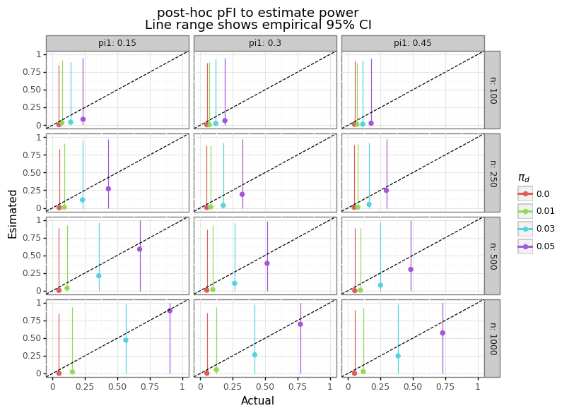

# Understanding the fragility index

## Summary

The goal of this post is to show that benefits and drawbacks of the FI. 

1. Drawback: The FI for a given study can vary depending on i) the whether positive cases are added to smaller proportion or subtracted from the larger, ii) the choice of the statistical test.
2. Drawback: may reinforce the dichotomous thinking approach
3. Benefit: can be shown to map to a post-hoc power calculation?

## (1) Background

Most published studies have exagerated effect sizes. There are two main reasons for this. First, academic studies are under-powered. This means they do not have enough samples to be able to detect small effects. Second, academic journals incentivize researchers to publish "novel" findings that are statistically significant. In other words, researchers will continue to try different variations of statistical tests  until something "interesting" is found.[[^1]] These two phenenoma ensure that what gets reported is exagerated because large effect sizes are what is needed to publish. 

As a reminder, the power of a statistical test defines the probability that an effect will be detected when it exists. Power is proportional to the sample size for [consistent](https://en.wikipedia.org/wiki/Consistency_(statistics)) tests because more samples leads to tigher inference around some effect size. While most researchers are aware of the idea of statistical power, a much small share understand that it is also [directly related](http://www.erikdrysdale.com/winners_curse) to effect size bias. Conditional on statistical significance, all measured effect are biased upwards, because there  is a minimum effect size needed for a test to be considered statistically significant.[[^2]] Evidence that most fields of scientific literature are underpowered are numerous: from [meta-studies](https://www.nature.com/articles/nrn3475) to the [Proteus phenomenon](https://en.wikipedia.org/wiki/Proteus_phenomenon). Many disciplines do not even require studies to make power justifications before research begins.[[^3]] 

One unfortunate reaction to the problem of low power is for researchers to carry out *post-hoc* (after-the-fact) power calculations, using the estimated effect size as the basis of the power calculations. This approach is highly problematic for three reasons. First, *post-hoc* power is [mathematically redundant](https://stat.uiowa.edu/sites/stat.uiowa.edu/files/techrep/tr378.pdf) since it has a one-to-one mapping with the conventially calculated p-value. Second, *post-hoc* power will always "show" high power for statistically significant results, and low power for statistically insiginicant results ([this post](https://blogs.worldbank.org/impactevaluations/why-ex-post-power-using-estimated-effect-sizes-bad-ex-post-mde-not) explains why).[[^X]] Lastly, in underpowered designs, the estimated effect will be extremely noisy, making *post-hoc* estimates of power [equally as noisy](http://www.stat.columbia.edu/~gelman/research/published/retropower_final.pdf)!

The *post-hoc* fragility index (FI) is relatively new statistical technique that uses an intuitive approach to quantify *post-hoc* statistical power in the case of a binary outcomes framework with two groups. Qualitatively, the FI states how many patients in the treatment group would need to have their status swapped from event to no-event in order for the trial to be statistically insignificant.[[^4]] Figure (1) below shows an example of a hypothetical study that has a FI of 3. Note, there are several technical nuances as to how to calculate the FI which are discussed below. The FI was first proposed in 2014 by [Walsh et. al (2014)](http://statmodeling.stat.columbia.edu/wp-content/uploads/2016/07/fragility-index-2014.pdf), and calculated for RCTs published in high impact general medical journals. They found median FI of 8, and a 25% quantile of 3. 

Since the original Walsh paper, the FI has been applied hundreds of times to other branches of the (mainly) medical literature.[[^5]] Most branches of medical literature show a median FI that is in the single digits. While the FI has its drawbacks (discussed below), this new approach appears to have captured the statistical imagination of researchers in a way that power calculations have not. While being told that a study has 20% power should cause immediate consternation, it apparently does not cause the same level of dismay as founding out an important cancer drug RCT was two coding errors away from being deemed ineffective.

The rest of this post is organized as follows: section (2) provides a technical definition of the FI and the different approaches in how to calculate it using `python` code, section (3) describes the relationship between the FI an other statistical quantities, section (4) reviews the criticisms against FI, and section (5) concludes.

## (2) Binomial proportion fragility index (BPFI)

In this section we'll use examine the distribution of the FI when the test statistic is the normal-approximation of a difference in a binomial proportion, what is hereafter referred to as the binomial proportion fragility index (BPFI). While Fisher's exact or chi-squared tests are usually used for estimating the FI from contingency tables, the BPFI is easier to study because it has an analytic solution. Two other simplifications will be used to allow for simpler analysis: the sample sizes will be the same between groups and a one-sided hypothesis test will be used. Even though the BPFI may not be standard, it is a consistent statistic that is [asymptotically normal](https://math.stackexchange.com/questions/2579383/proof-of-binomial-distribution-asymptotic-to-normal-distribution) and just as valid as using a chi-squared test. 

The notation used will be as follows: the statistic is the difference in proportions as $d$, whose asymptotic distribution is a function of the number of samples and the respective binary probabilities ($\pi_1, \pi_2$): 

$$
\begin{align*}
p_i &= s_i / n \\
s_i &= \text{Number of events} \\ 
n &= \text{Number of observations} \\
p_i &\overset{a}{\sim} N \Bigg( \pi_i, \frac{\pi_i(1-\pi_i)}{n} \Bigg) \\
d &= p_2 - p_1 \overset{a}{\sim} N\Bigg( \pi_2 - \pi_1, \sum_i V_i(n)  \Bigg) \\
d &\overset{a}{\sim} N\Bigg( \pi_d, V_d(n)  \Bigg) \\
\pi_d &= \pi_2 - \pi_1
\end{align*}
$$

Assume that $n_1 = n_2 = n$ and the null-hypothesis is $\pi_2 \leq \pi_1$. We therefore want to test whether group 2 has a large event rate than group 1.

$$
\begin{align*}
n_1 &= n_2 = n \\
H_0 &: \pi_d \leq 0, \hspace{3mm} \pi_1=\pi_2 \\ 
H_A &: \pi_d > 0 \\
d_0 &\overset{a}{\sim} N\big( 0, \big[ 2 \pi_1(1-\pi_1) \big]/n \big) \hspace{3mm} \big| \hspace{3mm} H_0 \\
d_A &\overset{a}{\sim} N\Big( \pi_d, \big[\pi_d +\pi_1(2-\pi_1) - (\pi_1+\pi_d)^2\big]/n \Big) \hspace{3mm} \big| \hspace{3mm} H_A \\
\hat{\pi}_d &= \frac{\hat{s}_2}{n} - \frac{\hat{s}_1}{n} \\
\hat{\pi}_i &= \hat s_i / n \hspace{3mm} \big| \hspace{3mm} H_A \\
\hat{\pi}_0 &= (\hat s_1 + \hat s_2)/(2n) \hspace{3mm} \big| \hspace{3mm} H_0
\end{align*}
$$
<!-- \label{eq:d_0} -->
<!-- \label{eq:d_A} -->

There are four factors worth highlighting about the distribution of $d_0$ and $d_A$. First, to calculate the variance of the test statistic when the null is false, we will in estimate the event rate by pooling by samples. Second, because the variance of the distribution for either \eqref{eq:d_0} or \eqref{eq:d_A} is unknown in advance, we could use a student-t correction to account for the slightly large tails, but as I'll show in simulations, this actually makes the test too conservative. Third, we can re-parameterize the distribution of $d_A$ as a function of $(\pi_1,\pi_d)$, in order to make the parameters in the first and second moment comparable. Lastly, our actual parameter of interest is $\hat\pi_d$, with $\pi_1$ being a nuissance parameter.

For a given type-1 error rate target ($\alpha$), and corresponding rejection threshold, we can now calculate the power of the test when the null is false.

$$
\begin{align*}
\text{Reject $H_0$: }& \hspace{3mm} \hat{d} > \sqrt{\frac{2\hat\pi_0(1-\hat\pi_0)}{n}}t_\alpha, \hspace{7mm} t_\alpha = \Phi^{-1}_{1-\alpha/2} \\
P(\text{Reject $H_0$} | H_A) &= 1 - \Phi\Bigg(  \frac{\sqrt{2 \pi_1(1-\pi_1)}t_\alpha - \sqrt{n}\pi_d }{\sqrt{\pi_d +\pi_1(2-\pi_1) - (\pi_1+\pi_d)^2}} \Bigg) \\
\text{Power} &= \Phi\Bigg( \frac{\sqrt{n}\pi_d - \sqrt{2 \pi_1(1-\pi_1)}t_\alpha }{\sqrt{\pi_1(1-\pi_1)+\pi_2(1-\pi_2)}} \Bigg) \\
\end{align*}
$$
<!-- \label{eq:power} -->

The formula \eqref{eq:power} shoes that increasing $\pi_d$, $n$, or $\alpha$ all increase the power. Figure 1 below shows that formula to estimate power is a close approximation for reasonable sample sizes.

<center><h3><b>Figure 1: </b></h3></center>
<center><p></p></center>

Given that the null has been rejected, we solve the roots of equation to find the exact point of statistical insignificance using the quadratic formula.

$$
\begin{align*}
n\hat{d}^2 &= 2\hat\pi_0(1-\hat\pi_0) t_\alpha^2 \hspace{3mm} \longleftrightarrow \\
0 &= \underbrace{(2n+t_\alpha^2)}_{(a)}\hat{s}_2^2 + \underbrace{2(t_\alpha^2(\hat{s}_1-n)-2n\hat{s}_1)}_{(b)}\hat{s}_2 + \underbrace{\hat{s}_1[2n \hat{s}_1 +t_\alpha^2(\hat{s}_1^2-2n)]}_{(c)} \\
\hat{\text{FI}} &= \hat{s}_2 - \frac{-b + \sqrt{b^2-4ac}}{2a}
\end{align*}
$$
<!-- \label{eq:fi1} -->

While equation \eqref{eq:fi1} is exact, we can approximate the FI by assuming the variance is constant:

$$
\begin{align*}
\hat{\text{FI}}_a &= \begin{cases} 
\hat{s}_2 - \Big(\hat{s}_1 + t_\alpha\sqrt{2n \hat\pi_0(1-\hat\pi_0)}\Big) &\text{ if $n_1 = n_2$} \\
\hat{s}_2 - n_2 \Big(\frac{\hat{s}_1}{n_1} + t_\alpha\sqrt{\frac{\hat\pi_0(1-\hat\pi_0)(n_1+n_2)}{n_1n_2}} \Big) &\text{ if $n_1\neq n_2$}
\end{cases}
\end{align*}
$$
<!-- \label{eq:fi2} -->

As Figure 2 shows below, \eqref{eq:fi2} is very close to the \eqref{eq:fi1} for reasonably sized draws ($n=200$).

<center><h3><b>Figure 2: BPFI and its approximation</b></h3></center>
<center><p></p></center>

Next, we can show that our approximation of the BPFI from \label{eq:fi2} is equivalent to a truncated normal when conditioning on statistical significance. 

$$
\begin{align*}
s_2 - (s_1 + t_\alpha\sqrt{2n \pi_1(1-\pi_1)}) \hspace{2mm} &\big| \hspace{2mm} s_2 - (s_1 + t_\alpha\sqrt{2n \pi_1(1-\pi_1)}) > 0\hspace{2mm} \longleftrightarrow \\
\text{pFI}_a &= \text{FI}_a \hspace{2mm} \big| \hspace{2mm} \text{FI}_a > 0 \hspace{2mm} \longleftrightarrow \\
\text{FI}_a &\sim N \big( n\pi_d - t_\alpha\sqrt{2n \pi_1(1-\pi_1)}, n[\pi_1(1-\pi_1) + \pi_2(1-\pi_2)]   \big) \\
E[\text{pFI}_a] &= n\pi_d - t_\alpha\sqrt{2n \pi_1(1-\pi_1)} + \sqrt{n[\pi_1(1-\pi_1) + \pi_2(1-\pi_2)]} \frac{\phi(-E[\text{FI}_a]/\text{Var}[\text{FI}_a]^{0.5})}{\Phi(E[\text{FI}_a/\text{Var}[\text{FI}_a]^{0.5}])}
\end{align*}
$$

<center><h3><b>Figure X: </b></h3></center>
<center><p></p></center>


If we divide the positive BPFI by root-n and the variance under the alternative (a constant) we can see that we obtain something converging to a monotonic transformation of the fragility index:

$$
\begin{align*}
E\Bigg[\frac{\text{pFI}_a \big/ \sqrt{n}}{\sqrt{\pi_1(1-\pi_1) + \pi_2(1-\pi_2)} }\Bigg] &= \Phi^{-1}(1-\beta) + \frac{\phi\big(-O\big(\sqrt{n}\big)\big)}{\Phi\big(O\big(\sqrt{n}\big)\big)} \\
&= \Phi^{-1}(\underbrace{1-\beta}_{\text{power}}) + O\Big(e^{-\sqrt{n}}\Big)
\end{align*}
$$

Where $\beta$ is the type-II error rate (i.e. one minus power).


<center><h3><b>Figure X: </b></h3></center>
<center><p></p></center>

<center><h3><b>Figure X: </b></h3></center>
<center><p></p></center>

## (3) Calculating the fragility index

Consider the classical statistical scenario of a 2x2 table of outcomes, corresponding to two different groups with a binary outcome recorded for each group. For example, a randomized control trial (RCT) for a medical intervention usually corresponds to this scenario where the two groups are the (randomized) treatment and control group and the study records some event indicator associated with a health outcome. Suppose in this trial that the event rate is greater in treatment than the control group, and that this positive difference is statistically significant. If we swap a patient from event to non-event for the treatment group, then the proportions between the groups will narrow, and the result will become less statistically significant by definition. 

The code below provides the wrapper function `FI_func` needed to calculate the the fragility index using the methodology as [originally proposed](http://statmodeling.stat.columbia.edu/wp-content/uploads/2016/07/fragility-index-2014.pdf): the sample sizes for both groups fixed, with the event rate being modified for only group 1. The algorithm works by either iteratively flipping one patient from event to non-event (or vice-versa) until there is a change in statistical significance. While a naive approach is simply to initialize the contingency table with the original data, I show that a significant speed-up can be accrued by estimating the FI with the BPFI as discussed in section 2. Conditional on any starting point, we apply the following rule:


1. Flip event to non-event in group 1 if event rate is larger in group 1 and current result is statistically significant
2. Flip non-event to event in group 1 if event rate is larger in group 1 and current result is statistically insignificant
3. Flip non-event to event in group 1 if event rate is smaller in group 1 and current result is statistically significant
4. Flip event to non-event in group 1 if event rate is smaller in group 1 and current result is statistically insignificant

Why would the direction be changed if the result is insignificant? The reason is because it means the BPFI has "over-shot" the estimate. For example, imagine the baseline event rate is 50/1000 in group 1 and 100/1000 in group 2, and the BPFI estimates that insignificance occurs at 77/1000 for group 1. When we apply the Fisher's exact test, we find that insignificance actually occurs at 75/1000, and to discover this we need to subtract off events from group 1 until the significance sign changes. In contrast, if the BPFI estimates that insignificance occurs at 70/1000, then when we run Fisher's exact test, we'll find that the results are still significant and will need to add patients to the event category until the significance sign changes.

As a final note, there are two other ways to generate variation in the estimate of the FI for a given data point:

1. Which group is considered "fixed"
2. Which test statistical test to use

To generate the first type of variation, the values of `n1A/n1` and `n2A/n2` can simply be swapped. Any function which takes in an 2x2 table and returns a p-value can be used for the second. I have included functions for Fisher's exact and the Chi-squared test.


```python
import numpy as np
import scipy.stats as stats

"""
INPUT
n1A:      Number of patients in group1 with primary outcome
n1:       Total number of patients in group1
n2A:      Number of patients in group2 with primray outcome
n2:       Total of patients in group2
stat:     Function that takes a contingency tables and return a p-value
n1B:      Can be specified is n1 is None
n2B:      Can be specified is n2 is None
*args:    Will be passed into statsfun

OUTPUT
FI:       The fragility index
ineq:     Whether group1 had a proportion less than or greater than group2
pv_bl:    The baseline p-value from the Fisher exact test
pv_FI:    The infimum of non-signficant p-values
"""
def FI_func(n1A, n1, n2A, n2, stat, n1B=None, n2B=None, alpha=0.05, verbose=False, *args):
  assert callable(stat), 'stat should be a function'
  if (n1B is None) or (n2B is None):
    assert (n1 is not None) and (n2 is not None)
    n1B = n1 - n1A
    n2B = n2 - n2A
  else:
    assert (n1B is not None) and (n2B is not None)
    n1 = n1A + n1B
    n2 = n2A + n2B
  lst_int = [n1A, n1, n2A, n2, n1B, n2B]
  assert all([isinstance(i,int) for i in lst_int])
  assert (n1B >= 0) & (n2B >= 0)
  # Calculate the baseline p-value
  tbl_bl = [[n1A, n1B], [n2A, n2B]]
  pval_bl = stat(tbl_bl, *args)
  # Initialize FI and p-value
  di_ret = {'FI':0, 'pv_bl':pval_bl, 'pv_FI':pval_bl, 'tbl_bl':tbl_bl, 'tbl_FI':tbl_bl}
  # Calculate inital FI with binomial proportion
  dir_hypo = int(np.where(n1A/n1 > n2A/n2,+1,-1))  # Hypothesis direction
  pi0 = (n1A+n2A)/(n1+n2)
  se_null = np.sqrt( pi0*(1-pi0)*(n1+n2)/(n1*n2) )
  t_a = stats.norm.ppf(1-alpha/2)
  bpfi = n1*(n2A/n2+dir_hypo*t_a*se_null)
  init_fi = int(np.floor(max(n1A - bpfi, bpfi - n1A)))
  # print((pval_bl, n1A, init_fi, n1A-dir_hypo*init_fi))
  if pval_bl < alpha:
    FI, pval, tbl_FI = find_FI(n1A, n1B, n2A, n2B, stat, alpha, init_fi, verbose, *args)
  else:
    FI, pval = np.nan, np.nan
    tbl_FI = tbl_bl
  # Update dictionary
  di_ret['FI'] = FI
  di_ret['pv_FI'] = pval
  di_ret['tbl_FI'] = tbl_FI
  di_ret
  return di_ret

# Back end function to perform the for-loop
def find_FI(n1A, n1B, n2A, n2B, stat, alpha, init, verbose=False, *args):
  # init=init_fi
  assert isinstance(init, int), 'init is not an int'
  assert init > 0, 'Initial FI guess is less than zero'
  n1a, n1b, n2a, n2b = n1A, n1B, n2A, n2B
  n1, n2 = n1A + n1B, n2A + n2B
  prop_bl = int(np.where(n1a/n1 > n2a/n2,-1,+1))

  # (i) Initial guess
  n1a = n1a + prop_bl*init
  n1b = n1 - n1a
  tbl_int = [[n1a, n1b], [n2a, n2b]]
  pval_init = stat(tbl_int, *args)
  
  # (ii) If continues to be significant, keep direction, otherwise flip
  dir_prop = int(np.where(n1a/n1 > n2a/n2,-1,+1))
  dir_sig = int(np.where(pval_init<alpha, +1, -1))
  dir_fi = dir_prop * dir_sig
  
  # (iii) Loop until significance changes
  dsig = True
  jj = 0
  while dsig:
    jj += 1
    n1a += +1*dir_fi
    n1b += -1*dir_fi
    assert n1a + n1b == n1
    tbl_dsig = [[n1a, n1b], [n2a, n2b]]
    pval_dsig = stat(tbl_dsig, *args)
    dsig = (pval_dsig < alpha) == (pval_init < alpha)
  vprint('Took %i iterations to find FI' % jj, verbose)
  if dir_sig == -1:  # If we're going opposite direction, need to add one on
    n1a += -1*dir_fi
    n1b += +1*dir_fi
    tbl_dsig = [[n1a, n1b], [n2a, n2b]]
    pval_dsig = stat(tbl_dsig, *args)

  # (iv) Calculate FI
  FI = np.abs(n1a-n1A)
  
  return FI, pval_dsig, tbl_dsig

# Wrappers for different p-value approaches
def pval_fisher(tbl, *args):
  return stats.fisher_exact(tbl,*args)[1]

def pval_chi2(tbl, *args):
  tbl = np.array(tbl)
  if np.all(tbl[:,0] == 0):
    pval = np.nan
  else:
    pval = stats.chi2_contingency(tbl,*args)[1]
  return pval

def vprint(stmt, bool):
  if bool:
    print(stmt)
```


```python
FI_func(n1A=50, n1=1000, n2A=100, n2=1000, stat=pval_fisher, alpha=0.05)
```


    {'FI': 25,
     'pv_bl': 2.74749805216798e-05,
     'pv_FI': 0.057276449223784075,
     'tbl_bl': [[50, 950], [100, 900]],
     'tbl_FI': [[75, 925], [100, 900]]}


As the output above shows, the `FI_func` calls return us the fragility index and corresponding table at the value of insignificance. We can flip the results to get the FI for the group 2.


```python
FI_func(n1A=100, n1=1000, n2A=50, n2=1000, stat=pval_fisher, alpha=0.05)
```


    {'FI': 29,
     'pv_bl': 2.74749805216798e-05,
     'pv_FI': 0.06028540160669414,
     'tbl_bl': [[100, 900], [50, 950]],
     'tbl_FI': [[71, 929], [50, 950]]}


Notice that the FI is not symmetric. When the baseline results are insignificant, the function will return a `np.nan`.


```python
FI_func(n1A=71, n1=1000, n2A=50, n2=1000, stat=pval_fisher, alpha=0.05)
```


    {'FI': nan,
     'pv_bl': 0.06028540160669414,
     'pv_FI': nan,
     'tbl_bl': [[71, 929], [50, 950]],
     'tbl_FI': [[71, 929], [50, 950]]}


## (4) Criticisms of post-hoc fragility

Since the FI first made a big splash, there are three main strands of criticism I've seen against it. I describe each three in order.

The first, and most technically sophisticated, argument made by [Potter (2019)]((https://pubmed.ncbi.nlm.nih.gov/32781488/)) is that FI is comparable between studies and does not actually do what it claims to do: quantify how "fragile" the result of a study is. Specifically, the FI does not quantify how likely the null hypothesis is (i.e. that there is no effect). If there are two statistically significant trials that have the same p-value, but differ in sample size, then it must be the case the trial with a smaller sample size has a larger effect. By looking at the [Bayes factor](), it can be shown that for any choice of prior, a small trial with a larger effect size is more indicative of an effect existing.

$$
\begin{align*}
\frac{a}{b}
\end{align*}
$$

> Therefore, if the probability model is correct (as in the coin toss example), the small trial provides more evidence for the alternative hypothesis than the large one. It should not be penalized for using fewer events to demonstrate significance. When the probability model holds, the FI incorrectly concludes that the larger trial provides stronger evidence.

For example, a study with 100 patients might have a p-value of 1e-6 and a FI of 5, whereas a study with 1000 patients with a p-value of 0.03 might have a FI of 10. In other words, the FI tends to penalize studies for being small, rather than studies that have a weak signal. Second, the fragility index will oftentimes come to the opposite conclusion of a [Bayes factor] analysis. As  puts it:

> By calculating the posterior probability of a treatment effect, we show that when the probability model is correct, the FI inappropriately penalizes small trials for using fewer events than larger trials to achieve the same significance level... Altogether, the FI creates more confusion than it resolves and does not promote statistical thinking. We recommend against its use. Instead, sensitivity analyses are recommended to quantify and communicate robustness of trial results.

Supporters of the FI would push back as follows: first, a simple way to make the FI comparable between studies is to use the fragility quotient (FQ), which divides the FI by either the sample size or the number of events (on both arms). Second, smaller studies should naturally be penalized in a frequentist paradigm, not because their alternative hypothesis are less likely to be true (which is what the Bayes factor tells us), but rather because the point estimate of the statistic conditional on significance is going to be exagerated. In other words, smaller studies have less power which have a larger effect size bias (I've provided explicit formulas for this [here](http://www.erikdrysdale.com/winners_curse/)). 

## (X) Conclusion

Other papers have shown the relationship between the FI and power, in this analysis we show an explicit analytic relationship when the statistic uses the binomial proportions test.

https://www.ncbi.nlm.nih.gov/pmc/articles/PMC6536113/

https://journals.plos.org/plosone/article?id=10.1371/journal.pone.0237879

https://academic.oup.com/eurheartj/article/38/5/346/2422087


As Perry Wilson [points out](https://www.methodsman.com/blog/fragility-index), the FI is really just another to critisize the use of dichotomous thinking when it comes to doing statistical evidence. If you flip a coin 100 times, and 60 of them are heads, and you use the usual 5% p-value cut-off, you will reject a null of an unbiased coin (p-value=0.045). But such a result has a FI of one, since 59 heads would have a p-value of 0.07. However, both results are "unlikely" under the null, so it seems stange to conclude the the initial finding should be discretided because of an FI of one. I think Wilson's point is right, but more for the broader problem it suggests. If the world's scientists went around flipping every coin they found lying on the side walk 100 times and then submitting "findings" to journals every time they got 60/40 or more/less heads, the world would appear to be festooned with biased coins. The bigger problem is that it's a silly hypothesis to test initially, and even if there are biased coins, the effect is probably very slight (50.1%) but the observed biases would be at least ±10% more extreme than what should be reported. This highlights the bigger problem of [scientific research](http://www.stat.columbia.edu/~gelman/research/published/pvalues3.pdf) and the file drawer problem. 


Because low power is not commmonly understood to be a problem in terms of effect sizes and reproducability, researchers have developed all sorts of mental ju-jitsu techniques to defend their weak studies. Such techniques include the "whatever doesn't kill my p-value makes it stronger" [argument](http://andrewgelman.com/2017/02/06/not-kill-statistical-significance-makes-stronger-fallacy/).[[^6]] Not to pick on [Justin Wolfers](https://www.econtalk.org/stevenson-and-wolfers-on-happiness-growth-and-the-reinhart-rogoff-controversy/#audio-highlights), but here is one example of such a sentiment:

> \[Y\]ou are suggesting both GDP and happiness are terribly mismeasured. And the worse the measurement is the more that biases the estimated correlation towards zero. So it's amazing that the estimated correlation is as high as 0.8, given that I'm finding that's a correlation between two noisy measures. 

Noise makes my claim stronger! Making such a statement against a more intuitive measure like the FI would be harder.


## Footnotes

[^1]: For example, researchers may find that an effect exists, but only for females. This "finding" in hand, the paper has unlimited avenues to engage in *post-hoc* theorizing about how the absense of a Y chromosome may or may not be related to this. 

[^2]: In other words, the distribution of statistically significant effect sizes is truncated. For example, consider the difference in the distribution of income in society conditional on full-time employment, and how that is shifted right compared to the unconditional distribution.

[^3]: In my own field of machine learning, power calculations are almost never done to estimate how samples a test set will need to be to bound some form of model performance.

[^4]: Note, this means the traditional FI can only be applied to statistically significant studies. A reverse FI, which calculates how many patients would need to be swapped to from statistical insignifance to significance has also been [proposed]().

[^5]: For full disclosure, I am a co-author on two recently published FI papers applied to the pediatric urology literature (see [here](https://www.sciencedirect.com/science/article/abs/pii/S1477513120303910) and [here]()). 

[^6]: As Gelman [puts it](http://www.stat.columbia.edu/~gelman/research/published/measurement.pdf): "\[I\]n noisy research settings, statistical significance provides very weak evidence for either the sign or the magnitude of any underlying effect".

[^X]: Applying any threshold to determine statistical significance will by definition ensure that post-hoc power cannot be lower than 50%.
